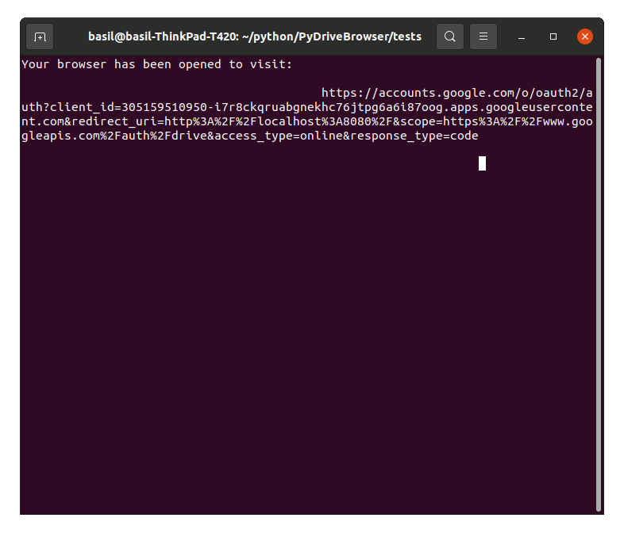

PyDriveBrowser
==============
PyDriveBrowser is a simple Command Line Interface to browse through a Google Drive.

It is based on [PyDrive2](https://github.com/iterative/PyDrive2) and [Pick](https://github.com/wong2/pick).

Installation
------------
Install PyDriveBrowser using pip:
```
pip install pydrivebrowser
```

To setup credentials (OAuth 2.0 Client IDs) check out the [documentation of PyDrive2](https://docs.iterative.ai/PyDrive2/quickstart/#authentication).

Demo
----

```
from cli_browser import CliBrowser

c = CliBrowser()
url = 'https://drive.google.com/drive/folders/1APzr67aMpXSkcMNlA0rWaJHvMoXwb9o8?usp=sharing'
f = c.select_file(url)
print(f'selected file: {f["title"]}')
```

Usage
-----
Simply pass a google drive url to `CliBrowser.select_file()` and get a `GoogleDriveFile` back.
For more information about the google drive files and authentication, consult [PyDrive2's documentation](https://docs.iterative.ai/PyDrive2/).
